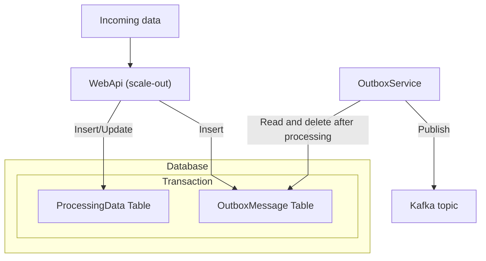

# SimpleTransactionalOutbox
C# implementation of the [Transactional outbox](https://microservices.io/patterns/data/transactional-outbox.html) pattern.


```mermaid
%%{init: {"flowchart": {"curve": "linear"}}}%%
flowchart TD
    Data[Incoming data]
    WebApi["WebApi (scale-out)"]

    subgraph Database[Database]
        subgraph Transaction[Transaction]
            ProcessingData[ProcessingData Table]
            OutboxMessage[OutboxMessage Table]
        end
    end

    OutboxService[OutboxService]
    Kafka[Kafka topic]

    Data --> WebApi
    WebApi -->|Insert/Update| ProcessingData
    WebApi -->|Insert| OutboxMessage
    OutboxService -->|Read and delete after processing| OutboxMessage
    OutboxService -->|Publish| Kafka
```

* Request to the WebApi changes processing data and creates outbox message in one transaction
* Outbox service reads actual messages and process one by one 
    * Publicates message
    * Removes message from outbox table  
    * Uses adaptive backoff when the outbox table is empty

Even if API will be scaled, messages will go to the stream in the correct order.

## Adaptive backoff

Outbox polling does not use a fixed delay.

* When at least one outbox row is found, the next polling cycle starts immediately
* When no rows are found, the service waits using adaptive backoff
* Backoff starts from `MinDelay`, grows on each empty polling attempt, and is capped by `MaxDelay`
* After a successful processing cycle, the delay is reset back to `MinDelay`

Configuration is stored in `OutboxHostedServiceOptions`:

```json
"OutboxHostedServiceOptions": {
  "MinDelay": "00:00:00.010",
  "MaxDelay": "00:00:00.500",
  "StepsCount": 10
}
```

Default values:

* `MinDelay`: `10ms`
* `MaxDelay`: `500ms`
* `StepsCount`: `10`

Incoming http POST message
```json
{
    "id":"1",
    "value":"42"
}
```

Kafka stream message
```json
{
   "MessageId":"e433fa40-9a18-4bb3-b820-6f027e7f585d",
   "OccurredOn":"2021-04-02T18:51:32.070031",
   "MessageType":0,
   "Body":"{\"Id\":1,\"Value\":42}"
}
```
