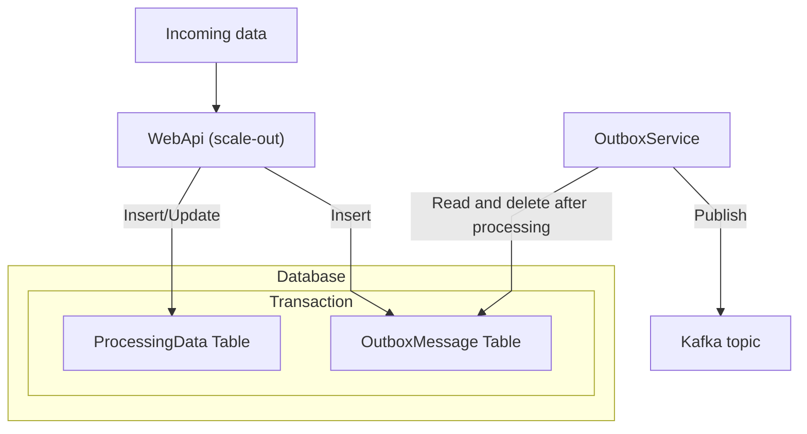

# SimpleTransactionalOutbox
C# implementation of the [Transactional Outbox](https://microservices.io/patterns/data/transactional-outbox.html) pattern.

## Overview
This repository contains two runtime services:

1. `WebApi`: accepts incoming HTTP messages, updates business data, and writes an outbox record in the same DB transaction.
2. `OutboxService`: polls outbox rows, publishes to Kafka, and deletes successfully published rows.


```mermaid
%%{init: {"flowchart": {"curve": "linear"}}}%%
flowchart TD
    Data[Incoming data]
    WebApi["WebApi (scale-out)"]

    subgraph Database[Database]
        subgraph Transaction[Transaction]
            ProcessingData[ProcessingData Table]
            OutboxMessage[OutboxMessage Table]
        end
    end

    OutboxService[OutboxService]
    Kafka[Kafka topic]

    Data --> WebApi
    WebApi -->|Insert/Update| ProcessingData
    WebApi -->|Insert| OutboxMessage
    OutboxService -->|Read and delete after processing| OutboxMessage
    OutboxService -->|Publish| Kafka
```

This preserves message delivery order and consistency even when `WebApi` is scaled out.

## Project Structure
- `src/WebApi`: ingest API (`POST /`), serialization, DB write, outbox write.
- `src/OutboxService`: background publisher from DB outbox to Kafka.
- `src/DB`: EF Core context, unit-of-work implementations.
- `src/Logic`: outbox processing logic and adaptive backoff.
- `src/Transport`: Kafka sender and Kafka options validation.
- `src/*/*.Tests`: unit tests.

## Prerequisites
- .NET SDK `10.x`
- PostgreSQL (reachable from both services)
- Kafka broker

## Configuration
Both services use default ASP.NET configuration loading:
- `appsettings.json`
- `appsettings.{Environment}.json`
- environment variables / command-line overrides

Example environment-variable override format:
- `ConnectionStrings__DefaultConnection`
- `OutboxHostedServiceOptions__MinDelay`
- `KafkaProducerOptions__BootstrapServers__0`

### WebApi appsettings
Configuration files:
- `src/WebApi/appsettings.json`
- `src/WebApi/appsettings.Development.json`

Required keys:

| Key | Required | Description |
| --- | --- | --- |
| `ConnectionStrings:DefaultConnection` | Yes | PostgreSQL connection string used by `OutboxContext`. |
| `Logging` | No | Standard ASP.NET logging levels. |
| `Serilog` | No | Serilog sinks and formatting settings. |
| `AllowedHosts` | No | ASP.NET host filtering. |

Behavior notes:
- API endpoint: `POST /`
- Health endpoint: `GET /hc`
- `OutboxContext` calls `Database.EnsureCreated()`; schema is created automatically if missing.

Minimal WebApi config example:

```json
{
  "ConnectionStrings": {
    "DefaultConnection": "Host=localhost;Port=5432;Database=outbox;Username=postgres;Password=1234"
  }
}
```

### OutboxService appsettings
Configuration files:
- `src/OutboxService/appsettings.json`
- `src/OutboxService/appsettings.Development.json`

Required keys:

| Key | Required | Description |
| --- | --- | --- |
| `ConnectionStrings:DefaultConnection` | Yes | PostgreSQL connection string for outbox polling and delete. |
| `OutboxHostedServiceOptions:MinDelay` | Yes | Initial delay for empty polls. |
| `OutboxHostedServiceOptions:MaxDelay` | Yes | Maximum delay for empty polls. |
| `OutboxHostedServiceOptions:StepsCount` | Yes | Number of empty poll steps to reach max delay. |
| `OutboxFetcherOptions:Limit` | Yes | Max outbox records fetched per cycle. |
| `KafkaOutboxSenderOptions:TopicName` | Yes | Kafka topic name for published outbox envelopes. |
| `KafkaProducerOptions:BootstrapServers` | Yes | Kafka bootstrap server list. |
| `Logging` / `Serilog` | No | Logging configuration. |

Validation rules enforced at startup:
- `OutboxHostedServiceOptions`:
  - `MinDelay > 0`
  - `MaxDelay > 0`
  - `MaxDelay >= MinDelay`
  - `StepsCount > 0`
- `OutboxFetcherOptions`:
  - `Limit > 0`
- `KafkaProducerOptions`:
  - `BootstrapServers` is non-null and non-empty
- `KafkaOutboxSenderOptions`:
  - non-null, non-empty, no whitespace
  - max length `249`
  - allowed characters: `a-z`, `A-Z`, digits, `-`

Minimal OutboxService config example:

```json
{
  "ConnectionStrings": {
    "DefaultConnection": "Host=localhost;Port=5432;Database=outbox;Username=postgres;Password=1234"
  },
  "OutboxHostedServiceOptions": {
    "MinDelay": "00:00:00.010",
    "MaxDelay": "00:00:00.500",
    "StepsCount": 10
  },
  "OutboxFetcherOptions": {
    "Limit": 10
  },
  "KafkaOutboxSenderOptions": {
    "TopicName": "outbox"
  },
  "KafkaProducerOptions": {
    "BootstrapServers": [ "localhost:9092" ]
  }
}
```

## Adaptive Backoff
Outbox polling does not use a fixed delay:

1. When at least one outbox row is processed, next cycle starts immediately.
2. When no rows are found, service waits with adaptive backoff.
3. Delay starts at `MinDelay`, grows linearly, and is capped by `MaxDelay`.
4. After a successful cycle, delay resets to `MinDelay`.

Defaults:
- `MinDelay`: `10ms`
- `MaxDelay`: `500ms`
- `StepsCount`: `10`

## Running Locally
From repository root:

```powershell
dotnet run --project .\src\WebApi\WebApi.csproj
dotnet run --project .\src\OutboxService\OutboxService.csproj
```

Note:
- both projects have the same launch profile ports by default; if running together, override one service URL via `ASPNETCORE_URLS`.

## API and Message Examples
Incoming HTTP `POST /` body:

```json
{
  "id": "1",
  "value": "42"
}
```

Kafka envelope message:

```json
{
  "MessageId": "e433fa40-9a18-4bb3-b820-6f027e7f585d",
  "OccurredOn": "2021-04-02T18:51:32.070031",
  "MessageType": 0,
  "Body": "{\"Id\":1,\"Value\":42}"
}
```

## Health Checks
- WebApi: `GET /hc`
- OutboxService: `GET /hc`

## Tests
Run all tests:

```powershell
dotnet test .\src\SimpleTransactionalOutbox.slnx
```

## Troubleshooting
- Invalid options at startup:
  - check `OutboxHostedServiceOptions`, `OutboxFetcherOptions`, `KafkaOutboxSenderOptions`, `KafkaProducerOptions`.
- DB connection errors:
  - verify `ConnectionStrings:DefaultConnection` for both services.
- Kafka publish failures:
  - verify `KafkaProducerOptions:BootstrapServers` and `KafkaOutboxSenderOptions:TopicName`.
