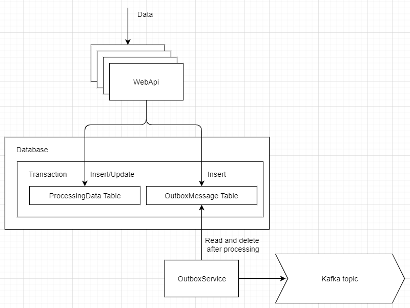

# SimpleTransactionalOutbox
C# implementation of the [Transactional outbox](https://microservices.io/patterns/data/transactional-outbox.html) pattern.

 

Incoming http POST message
```
{
    "id":"3",
    "value":"3"
}
```

Kafka stream message
```
{"MessageId":"e433fa40-9a18-4bb3-b820-6f027e7f585d","OccurredOn":"2021-04-02T18:51:32.070031","MessageType":0,"Body":"{\"Id\":3,\"Value\":3}"}
```
